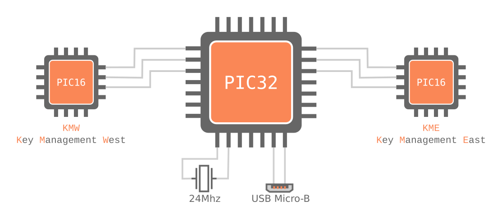

# AXIOM Remote Bootloader

## Description

Bootloader will be used to update the firmware of the main PIC32 and also the east and west PIC16s (key managers).

## Structure

**TODO** Add content

## Unsorted TODOs

* Add copyright headers to .h files

* Add FIFOs for communication between bootloader (BL) and user applciation (UA)

* ...
