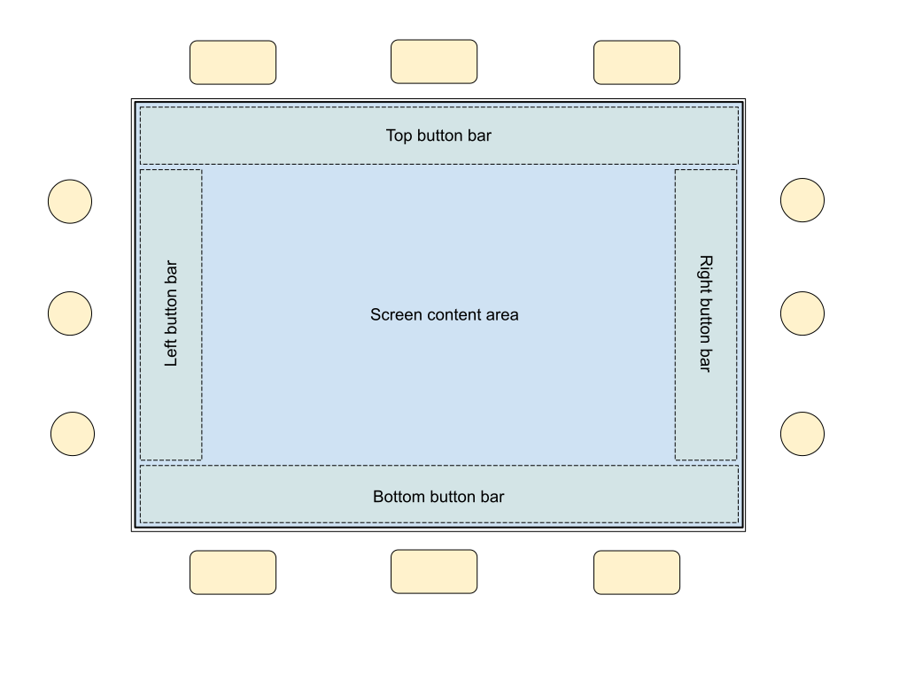

# AXIOM Remote Firmware

This software runs bare metal on the PIC32MZ. 

Further documentation/hardware schematics please see:
<https://wiki.apertus.org/index.php/AXIOM_Remote>

## General UI Guidelines

Good User Interface (UI) / User Experience (UX) principles:

* any button/knob/dial (anything the user can interact with) should clearly show what will happen when it is pressed/turned/operated before doing so. Button labels should use actions like “Set” or “Start” instead of “OK” or “Yes”, etc. If turning the knob has an effect it should be clearly shown what will happen with icons/graphics/etc. No button should be called “User 1” or “A”, “B”, etc.
* The different screens should have a clear hierarchy or layout structure (like a big map) so the user always knows “where am I currently”. This shall be achieved with breadcrumbs, scrollbars, navigation bars, clear headers, shifting animations when switching screens, etc.
* Creating operating experience by using clear patterns for button placements. Eg. The CANCEL button is always at the bottom left, the primary action button always at the bottom right. The HOME and BACK buttons are always in the same place in the left sidebar. This makes learning the UI easy and fast, avoids confusion and creates trust.
* Big camera manufacturer Sony is known for their "infamous" UI designs choices with their cameras. A main problem they have is that setting some options have wide reaching implications that are not made obvious in the UI. For example some codecs require more processing power than others resulting in higher battery drain so Sony dims the LCD brightness to reduce battery drain and processor overheating with that particular codec. The user is not supplied with any such information so starts to wonder why the LCD is suddenly darker after choosing another codec. -> Any implication an action has should always be communicated in the UI before executing such action - if there is no space/way to do it in the menu/page directly this can be done for example in a “confirm action screen” that pops up when the user chooses to execute a change. Also options that are disabled because of another setting should never just disappear, rather they should be read-only and show an explanation why this option is disabled, example: “100 fps - disabled because of codec choice ABC..”.

## Terms used in GUI

<p align="center">
  
  <p style="text-align: center;font-style:italic;"></p>

Following terms can help understand the GUI better:

**Screen**: refers to the entire content of the LCD visible at one time. Currently, there are two types of screens: Pages and Menus


**Page**: A page refers to the display type where the 12 buttons around the TFT are utilized for navigation/operation. Each of the 6 PageItem on screen is associated with one of the three buttons above or below the TFT. Pages could be seen like "desktops" on a PC with icons on them to click.

**PageItem**: Each item on a page acts like a button and can execute an action or can lead to another page or menu when clicked

 **Menu**: It refers to a screen with a header (showing breadcrumbs) and 7 menu_items displayed at the same time on the LCD (scrollbars are automatically shown if more than 7 menu items are present. A menu is typically navigated with the rotary/push knob. 


**MenuItem**: It refers to one option/line in the menu, can be hidden or disabled and can show readonly information, lead to another submenu or contain a boolean, numeric or dropdown list like selection. 

**PopUpParameterMenu**: This menu pops up when a menu item containing a dropdown list selection parameter is clicked. A black circle before an item shows the currently active option. A highlighted line shows the current selection/cursor. This menu only works for 7 or less choices and the options strings need to be relatively short to fit the screen area. *(class: PopUpParameterMenu)*


**ParameterListScreen**: Works like the PopUpParameterMenu but uses the entire screen to display choices. It also works with more than 7 choices. The currently highlighted choice is kept in the center and options scroll through underneath. A black circle before an item shows the currently active option. *(class: ParameterListScreen)*


**NumericValueScreen**: To set a parameter to a numeric value (Integer) there is a special screen that shows the range of avaiable values (minimum on the left, maximum on the right). A stepsize can be defined to set how much the value should increase/decrease with one step of the jog wheel. A header shows what parameter is currently being altered. No float values can be set.


## Usage instructions

- USB communication to/from the AXIOM Remote is done via a USB communications device class (CDC)
- **sudo minicom -D /dev/ttyACM0** (baud rate is not required)

## Important classes

* Interfaces start with capital i, e.g. _IButton_ or _IScreen_
  * They should be used in most cases when passing data to classes, methods etc.

| Interface | Description           | Usage examples               |
| --------- | --------------------- | ---------------------------- |
| IButton   | Interface for buttons | PushButton, ImageButton      |
| IScreen   | Interface for screens | MainPage, WhiteBalanceScreen |

* General functionality should be placed in the base class, like title drawing or button bar handling
  * we do not have a strict division for now, which is normally done in OOP, so it's fine to extend the interface class, like IScreeen, with caption and button bar rendering and handling

  * If different behavior is required, then it can easily be overridden in C++, see **virtual** and **override** keywords. One of the advantages is reduced probability of errors, because the code is only placed in one class.

## LCD

The drawing origin (X,Y = 0,0) is located in the top left corner. The LCD is used in landscape (widescreen) mode.

Currently the whole display is updated at once with every frame redraw, but in the future we will involve so called _dirty rectangles_ to reduce time which is required to update the screen, to improve the performance and lower the power usage. For this purpose the method _DrawPixel()_ in _Painter_ could store the min and max coordinates of requested drawing operations and when screen update will be called, the data range could be selected based on this coordinates.

## Screens

### General

TODO

### Buttons

There are 12 options for "edge buttons" which are placed around the LCD edges, 3 on each side (see _Figure 1_), this is also why the ButtonBar has only 3 entries:left, center and right.

> It can be confusing for left and right bars, but they can be described as _left_ is _top_ and _right_ is _bottom_. Another possibility to change the _ButtonPosition_ enum to _First_, _Second_ and _Third_

Like the example for the bottom button bar in _IScreen_, other ones can be created in the same way, as we know that the screens can’t have different structure, just different features are activated on individual screens, depending on the requirements.

As every screen has different requirements, the methods which add buttons to the bars, like SetBottomButton() can be adjusted, so they set a variable, like

```cpp
if(!_showBottomBar)
{
 _showBottomBar = true;
}
```

This would allow rendering the required bars automatically. If we have to deactivate the bars, then additional methods, like ShowBottomBar(bool show), can be implemented.

## Communication Protocol

To communicate between AXIOM Remote and AXIOM Camera a simple ASCII based line prototcol is currently envisioned (not implemented yet):

Format:
```
Xyyyy(<RS>FIELD)*<EOT>zz<NUL>
```

where `X` indicates the request type, currently

- `G` for get
- `S` for set
- `R` for return value / reply

Get / set requests are initiated by the remote and answered asynchronously by the beta with a `R`

`yyyy` is a alphanumeric id, for example a counter formatted in hex counting up

`zz` is the CRC8 (polynomial `0x7`, initial value `0x0`) in hex of everything, including the RS and the EOT (end of transmission - ASCII code 0x04) character.

After the id a variable number of fields can follow. Each field is prefixed by RS and can contain any byte but RS (ASCII code 0x1E) and EOT (ASCII code 0x04). The end of the fields is indicated by EOT and the end of the message (after the two CRC bytes) is indicated by NUL (ASCII code 0x00).

For replies the id matches the id of the (get or set) request. The replies are allowed to occur out of order.

example:
```
[remote to beta] G0000<RS>analog_gain<EOT>35<NUL>
[remote to beta] G0001<RS>analog_gain<EOT>d0<NUL>
[beta to remote] R0001<RS>OK<RS>1.2<EOT>eb<NUL>
[beta to remote] R0000<RS>OK<RS>1.4<EOT>ec<NUL>
```

The remote should use a timeout of `1s` for long running requests.

## Exception handling

If the AXIOM Remote crashes on a general exception (handlers for other exceptions are not implemented yet) information about the cause and code address will be transmitted over UART.

Example: 
```
GE EA:9D005988 C:0D
```

### Fields

| Name | Description       |
| ---- | ----------------- |
| GE   | General exception |
| EA   | Exception address |
| C    | Cause             |

Note that the fields values are displayed in hexadecimal.

### Causes

TODO: Check chapter 7.1 in the PIC32 datasheet (column EXCCODE) and add missing ones, if required (https://ww1.microchip.com/downloads/en/DeviceDoc/60001191G.pdf)

| Code (hex) | Description                              |
| ---------- | ---------------------------------------- |
| 0          | Interrupt                                |
| 4          | Address error exception (load or ifetch) |
| 5          | Address error exception (store)          |
| 6          | Bus error (ifetch)                       |
| 7          | Bus error (load/store)                   |
| 8          | Syscall                                  |
| 9          | Breakpoint                               |
| A          | Reserved instruction                     |
| B          | Coprocessor unusable                     |
| C          | Arithmetic overflow                      |
| D          | Trap (possible divide by zero)           |

## Interfacing with the East/West PIC16

Two additional smaller PIC16 are used for handling push button, rotary encoder and LED IO.

They are connected to the PIC32MZ via i2c:

### PIC16F1718 West

```
    Index   Bits    Function
    0x00    [7:0]   Port A Change
    0x01    [7:0]   Port B Change
    0x02    [7:0]   Port C Change
    0x03            unused
    0x04    [7:0]   Port A Status
    0x05    [7:0]   Port B Status
    0x06    [7:0]   Port C Status
    0x07            unused
    .
    .
    .
    0x10    [7:0]   Quadrature Encoder 1
    0x11    [7:0]   Quadrature Encoder 2
    0x12            unused
    .
    .
    .
    0x20    [7:4]   Red Pattern
            [3:0]   Red PWM
    0x21    [7:4]   Green Pattern
            [3:0]   Green PWM
    0x22    [7:4]   Blue Pattern
            [3:0]   Blue PWM
    0x23    [7:0]   Pattern/PWM Load (auto clear)
    0x24            unused
    .
    .
    .
    0x30    [7:0]   Pattern Red [7:0]
    0x31    [7:0]   Pattern Red [15:8]
    0x32    [7:0]   Pattern Green [7:0]
    0x33    [7:0]   Pattern Green [15:8]
    0x34    [7:0]   Pattern Blue [7:0]
    0x35    [7:0]   Pattern Blue [15:8]
    0x36    [7:0]   Pattern Load
```

### PIC16F1718 East

```
    Index   Bits    Function
    0x00    [7:0]   Port A Change
    0x01    [7:0]   Port B Change
    0x02    [7:0]   Port C Change
    0x03            unused
    0x04    [7:0]   Port A Status
    0x05    [7:0]   Port B Status
    0x06    [7:0]   Port C Status
    0x07            unused
    .
    .
    .
```
