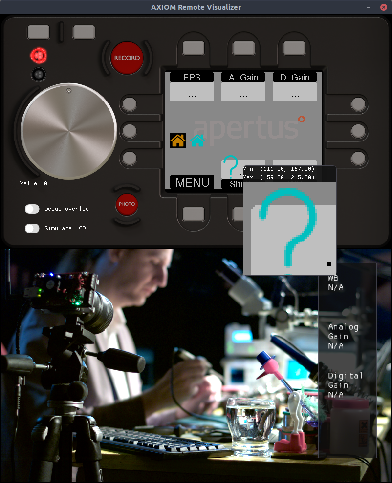

# Draw2BitIcon()

## Creating icons
Creating icons is currently done with a separate Python script,  
please see https://github.com/MarkusEngsner/png2Cheader

It works for PNGs and SVGs, using CairoSVG and Pillow.

## Draw2BitIcon()
`Draw2BitIcon()` currently supports picking a foreground color,  
as well as a background color.  
It then uses these colors to interpolate color values for pixels  
with the values `0x1` and `0x2`.  
The interpolation is currently done linearly,
with fixed values representing `0x1` and `0x2`, respectively.  

### Implementation

#### Helpers  

* `Utils::AlphaBlend (Utils.cpp)`: Linear interpolation between two colors.
* `Painter.GetPixel (Painter.cpp)`: Helper to get the
  current color at a point in the framebuffer. 
  This currently does not do any bounds checking.
* `Painter.GetColor (Painter.cpp)`: Maps a 2Bit representation of a Pixel to a color.

I put `AlphaBlend` in to `Utils`, because it's a very generic function,
useful whenever colors are being handled.
To be able to declare this function without `static inline`,
I split the declaration and definition.  
I modified the `CMakeLists.txt` files for the visualizer and the
tests to account for this.

`GetColor()` doesn't need to be in the Painter class, 
as it's just a helper which doesn't require access to any `Painter` internals.  
However, because all helper function seem to be placed inside the class,
I did this with `GetColor()` too.  
This will also make it easier to modify the values for the Alpha blending
in the future.

#### The function itself

`Draw2BitIcon` iterates over the entire framebuffer, one row at a time.  
I choose to diverge slightly from the original implementation of `DrawIcon()`,  
which uses two loops for each row.  
My solution does result in defining `currentByte` 
with the same value 4 times for each byte,  
but in return it reduces the complexity by only needing 1 loop per row.

### Testing
Tests have been implemented for the `Draw2BitIcon()` function,
as well as for the helpers.

## Screenshot

*Picture showing the home icon being rendering with and without transparency,
in addition to the help icon.*
