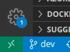
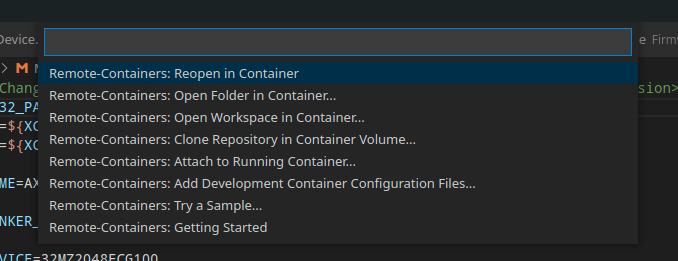

# AXIOM Remote

## Build status

| dev |
|:------:|
[](https://github.com/apertus-open-source-cinema/AXIOM-Remote/actions/workflows/firmware-build.yml)
|[](https://codecov.io/gh/apertus-open-source-cinema/AXIOM-Remote)

## Preview (3D)
http://apertus-open-source-cinema.github.io/AXIOM-Remote

## Description

A universal remote control with buttons, dials and an LCD for menu/settings (no live video) for AXIOM devices and potentially many other things as well.

## License

This program is free software; you can redistribute it and/or modify
it under the terms of the GNU General Public License 2 as published by the Free Software Foundation.
for details see: LICENSE.txt

## Folder Structure

```/.vscode/``` contains configurations for VS code IDE.

```/Archive/``` contains old outdated projects related to the AXIOM Remote.

```/AXIOM_Remote_Firmware_Visualizer/``` contains the AXIOM Remote Visualizer - a tool to emulate the actual code running on the RP2040 and pixels displayed on the 320x240 LCD on a PC.

```/Bootloader/``` The Bootloader will be used for handling of periphery (LCD, USB-UART, I2C) and updating the firmware.

```/Common/``` contains general code and definition that are used in several projects in this repository.

```/datasheets/```  contains datasheets related to the used hardware (TFT and TFT controller, etc.).

```/Docs/``` contains illustrations and drawings

```/Firmware/``` contains the actual Firmware of the AXIOM Remote - this is the main folder of this repository. See the [README.md](/Firmware/README.md) inside the subfolder for more documentation about the GUI structure of the AXIOM Remote.

```/FirmwareTest/``` contains unit tests of the Firmware.

## Build instructions

### Setup RP2040 Build Environment

Before building, you need to set up the Raspberry Pi Pico SDK and toolchain. Please follow the official guide for your operating system: [https://datasheets.raspberrypi.com/pico/getting-started-with-pico.pdf](https://datasheets.raspberrypi.com/pico/getting-started-with-pico.pdf)

Ensure the `PICO_SDK_PATH` environment variable is set correctly.

### Bootloader

- Open **Bootloader** folder in terminal
- Execute **make** or when rebuilding **make clean && make**
- **HEX** and **ELF** files would placed in the **build** folder
- After flashing connect with **minicom** and reset the board, after a short moment the information about west key manager will be shown

### Firmware

- Open the **Firmware** folder in a terminal.
- Create a build directory: `mkdir build`
- Change into the build directory: `cd build`
- Run CMake: `cmake ..`
- Run Make: `make`
- The build output, including the `axiom_remote.uf2` file, will be in the `build` folder.

## Flash instructions

- Connect the AXIOM Remote to your computer via USB while holding down the `BOOTSEL` button on the RP2040 board.
- It will mount as a mass storage device named `RPI-RP2`.
- Drag and drop the `Firmware/build/Axiom_Remote_Firmware.uf2` file onto the `RPI-RP2` volume.
- The board will automatically reboot and run the new firmware.

## Development Environment

We use Visual Studio Code (<https://code.visualstudio.com/>) as IDE and supply some configurations for it in /.vscode/ .
This means its important to open the root folder of this repo in VS code.

We recommend installing the VsCode Action Buttons extension: <https://marketplace.visualstudio.com/items?itemName=seunlanlege.action-buttons> and configurations (.vscode/settings.json) to add buttons to compile and flash the AXIOM Remote.

### Developing inside Docker container

To avoid the need to install all the required and helpful tools, you can also use a Docker container we provide for development. Follow the steps to set it up in VSCode:

- Open the repository folder in VSCode
- Install **Remote - Containers** extension
- Click on the green button in the lower-left corner and select **Remote-Containers: Reopen in Container**

Remote container button | Remote container dialog
:-------------------------:|:-------------------------:
 | 
- Use the terminal in VSCode for builds, like you've did on your machine before
  - **minicom** is already included for serial debugging, if required.

## Coding Guidelines ##

Please refer to the [CodingGuidelines.md](CodingGuidelines.md)
